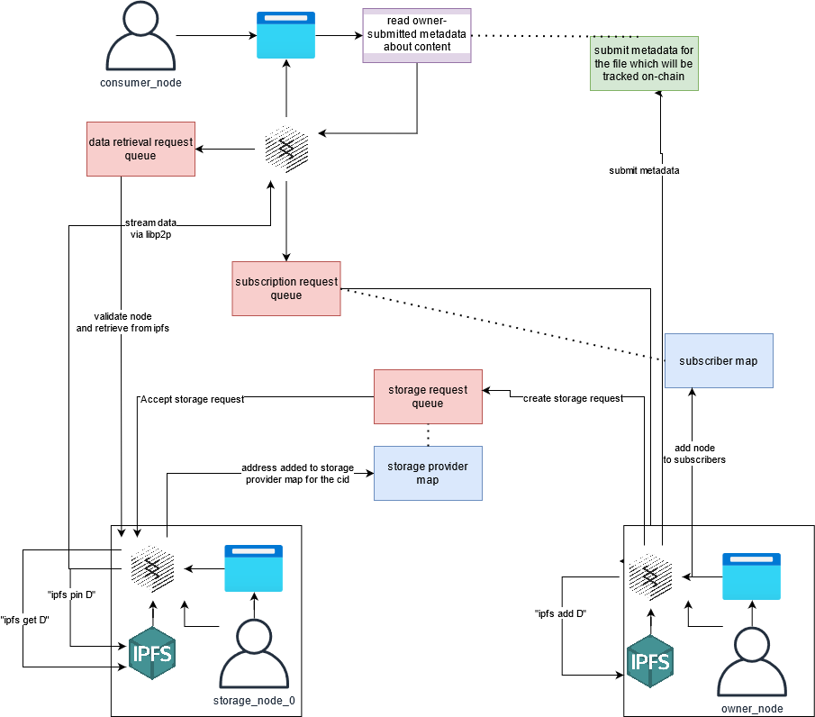

# W3F Grant Proposal

* **Project Name:** Mercury
* **Team Name:** -
* **Payment Address:** 0x6ec0D6c005797a561f6F3b46Ca4Cf43df3bF7888 (DAI)

## Project Overview :page_facing_up:

### Overview

Mercury is a fully decentralized data management solution which adds additional functionality and structure to a private IPFS cluster by leveraging Substrate. Our initial use case will be to construct a fully decentralized pinning service. Current solutions for decentralized storage are either lacking in security and privacy or rely on some centralized service. To illustrate this point, consider how the usage of a pinning service (such as Piñata) necessitates centralization, since the ipfs cluster in use is behind a centralized API and paywall, or how Textile de-decentralizes Filecoin. A fully decentralized approach provides individuals a platform without the risks associated with centralized APIs and the additional opportunity to profit from their passive storage. In addition to the benefits of decentralization, the modularity and upgradeability provided with substrate would allow us to easily account for API changes or library upgrades. We propose a *decentralized pinning service*, facilitating an ecosystem that:
* incentivizes and rewards nodes to provide off-chain storage
* provides on-chain governance and moderation
* more control over your data and the ability to store and share private data

 There are various real world benefits resulting from this approach. IPFS provides a more resilient and efficient way to access data. Not only does it provide more cost efficient storage and hosting, but also more cost efficient access, as there is no third party that acts as platform owner and maintainer. Transparent governance and moderation is also easily achievable with this approach. We also provide a means of passive income for storage providers. Content creators also benefit from a higher degree of freedom, means of support/funding, etc., but also a higher degree of accountability and traceability.

### Project Details
Mercury expands on [previous work](https://github.com/rs-ipfs/substrate) which laid the groundwork for IPFS integration with substrate and the runtime module which will be our initial focus. The goal of this proposal is to build a fully decentralized pinning service along with a sample user interface. We will accomplish this by introducing new runtime modules that allow nodes to request data from other nodes outside of IPFS, building an offchain-worker to handle data encryption/decryption, developing a reward distribution scheme for nodes providing storage (via pinning content in ipfs), and constructing a system through which new nodes can securely join the private ipfs network.

We will accomplish this by using a collection of requests that are fulfilled by offchain workers. From a 30,000 foot view of this project, there will be four separate queues that nodes can send requests to.

* The connection request queue: Nodes in this queue are requesting to connect to the private ipfs network.
* The subscription request queue: Nodes in this queue are requesting to be added to the subscribers map for some CID `C`, as well as retrieve any private keys needed.
* The storage request queue: Nodes in this queue are requesting that other nodes store some CID `C`. This will come accompanied with metadata as well as terms and conditions for reward distribution and amount.
* The data retrieval request queue: Nodes in this queue are requesting some data from the network. 

The associated maps of node addresses:
* The connected peers map
  * This tracks all peers in the ipfs network. 
* The subscribers map
  * This can exist at the ipns of CID level. Members of a subscribers map for a cid can request and download it from storage providers.
* The storage providers map for `C`
  * This is all online peers that are pinning some cid `C`

##### Terminology and Use Cases
Let `C` be some CID.

* An **owner** is the node that added `C`, along with relavant metadata, rules, etc. to the network.
* A **storage provider** for a CID `C` is a node that has `C` pinned.
* A **consumer** is any node that requests to download `C` or subscribes to `C`.

A basic use case would be where a content owner `A` wants to make some data `D` both secure, purchaseable, available to some consumer `B`. We will solve this by allowing for a third party, `C`, a storage provider, to hold onto content owned by `A` and deliver it to `B` when requested. We intend to abstract IPFS away from the consumer entirely. 

1) A node joins the private IPFS network by invoking the `JOIN` extrinsic. This initiates a process through which the new node receives the swarm key that allows them to join the private ipfs network. This is only applicable is a node wants to add or store data in IPFS. Read-only access does not require a connection to IPFS.
2) A node invokes the `ADD` extrinsic, supplying the data they want to upload and associated metadata
   1) Private-data approach
      1) generate or *retrieve* a private-public key pair (pubephem, privephem) 
      2) encrypt the data with the pair from (1.1)
      3) invoke an extrinsic to call `ipfs add encrypted_data`.
      4) create:
         1) publish purchase data: specify terms that a node must meet in order to know privephem
         2) publish pin request: create a request that specifies, contractually, terms for hosting the content.
   2) Public Data approach
      1) invoke an extrinsic to call `ipfs add data`.
      2) create:
         1) publish metadata data: specify that no subscription is required
         2) publish pin request: create a request that specifies, contractually, terms for hosting the content.
3) Consumer invokes the `SUBSCRIBE` extrinsic (**for private, encrypted data only**)
   1) reserve a specified number of coins (from (2.1.3)) to be added to the subscription request queue.
   2) The owner must send the private key to the consumer. This will be done by the following process, and will be performed automatically given that the owner is online:
      1) The owner creates a message containing the private key and encrypts it using the consumer's public key
      2) The owner encodes this message in a transaction
      3) The consumers decodes the message and can now decrypt the data
4) Consumer invokes the `DOWNLOAD` extrinsic. 
   1) verify that the user is part of the subscribers collection for the CID
   2) call `ipfs get encrypted_data` to retrieve the data. Note that the is not guaranteed to be available due to the decentralized nature of the system.
5) Consumer can now share the private key with other new purchasers. That is, they can send an encrypted private key message to another subscriber when authorized. 
6) A storage provider node invokes the `PIN` extrinsic.
   1) The storage provider calls `ipfs pin encrypted_data` and starts earning rewards. Rewards and distribution is discussed [here](#fee-distribution-to-storage-providers).

Omitting the connection queue until later, a basic data flow of a node subscribing to data and retrieving from a storage provider is illustrated.

##### The Private Network
The genesis block and the ipfs cluster are synchronized. When the private network is created we will allow a static set of nodes to join. These bootstrap nodes will be encoded in the genesis block. Nodes joining the network must do so by invoking the `JOIN` extrinsic, which starts the process through which they can receive the swarm key. The process is broken down as:
1) a request is added to a queue
2) A bootstrap node can then monitor this queue. When the new item is added the bootstrap node will create encrypt its `swarm.key` with a newly created public/private keypair and then send the file to the new node. 
3) It will then construct a message containing the private key needed to decrypt the message and encrypts that message using the new node's public key. 
4) The new node decrypts all messages to recover the swarm key
   1) decrypt the first message with the new node's private key to get the privephem
   2) decrypt the encrypted swarm.key with privephem.
   3) connect to the private cluster by injecting swarm.key into ipfs via a `CONNECT` extrinsic.

##### Data and its availability
Suppose a node has some data, D. To add the data to the private IPFS network it invokes the `ADD` extrinsic. This exstrinsic accepts a byte array (the content to be passed to IPFS) along with associated metadata (filename and extension). The runtime adds D to the network (`ipfs add D`) and retrieves a CID, CD. To control access to CD we impose a rule that nodes may only retrieve data (from the IPFS network) given they are members of an associated subscribers map (More details on this [here](#data-access-auth-and-retrieval)). This subscribers map will be defined within a **subscribable**.

A **subscribable** is an entry in a StorageMap which maps an ipns address to a collection of addresses which are all 'subscribed' to the ipns address. A subscribable has an associated owner address and a collection of CIDs which are accessible given you are a subscriber. A subscribable is the first view a consumer has of your data and so contains (filename, type, description). A subscribable can also dictate the price and terms of subscription, and can be expanded to have a more dynamic ruleset, however we will delegate this discussion to the [future plans](#future-plans).

A subscribable also forms the basis for allowing peers to pin your content. Any peer can pin any content if they choose to without limitation. However, we also want to allow nodes to reserve storage as well. When defining a subscribable, an owner can also define a storage contract, in which they specify a maximum storage fee in TOKEN/kb/epoch_blocks, where TOKEN is a TBD token and epoch_blocks is some number of blocks. They then reserve some amount of tokens, `R`, which any node that agrees to the contract extracts from. Let's break this down step by step:

Suppose a node has an `X kb` file that they've added to IPFS and they agree to pin their file for a max of `M TOK/kb/epoch`, where `epoch = B blocks`. Then the maximum fee paid per epoch by the owner is `M * X * B TOK`, for at least `R/(M * X * B) epochs`, or `R/(M * X) blocks`. The owner pays the pinning node each epoch, as long as it is pinned for the entire epoch. A storage contract also limits the maximum number of storage nodes that can store the content. 

##### Data Access Auth and Retrieval
Data retrieval directly from IPFS will not be available by read only nodes. Instead, to retreive a CID `C` a node will invoke a `REQUEST_DATA` extrinsic, which will add a request to a queue. A node that has `C` pinned will pick up the request and verify that the user has access to the content (is a subscriber, or content it open to all). We will then leverage libp2p to send the data to the requesting user. The requesting node will send a maximum network fee to retrieve the content, which is then rewarded to the node that delivered it. (note: this is another incentive for nodes to pin data in high demand).

We want to allow nodes to upload private data in order to build a data marketplace on top of the storage marketplace. To access private data a node will need to meet the conditions defined in the subscribable. When the conditions are met, the node's address is added to the `subscription request queue`. The owner node then encrypts a message containing the private key required to decrypt the subscribable using the consumer's public key. The consumer is added as a subscriber and can decrypt the message when retrieved.

##### Fee Distribution to Storage Providers
Nodes that agree to pin a CID do so individually. Nodes should be able to freely pin any content that they want to.

##### Governance
A problem inherent to decentralization is abuse of the privacy and security offered by the technology. For example, if the platform is used to host illegal content, or mislabeled content, or malicious content, then we need to be able to anticipate, identify, and purge this content and associated nodes from the network.

We cannot remove data from somebody's private, local storage. However, we can implement a mechanism that blocks that address from delivering or fetching a CID.

#### What it is not
* Data stored is immutable but not indefinitely *persistent*. That is, your data will only be ensured to be available as long as there is incentive for a pool to hold it. Pinning in this context is still subject to the limitations outlined here: **https://docs.ipfs.io/concepts/persistence/**.

### Ecosystem Fit

Help us locate your project in the Polkadot/Substrate/Kusama landscape and what problems it tries to solve by answering each of these questions:

* Where and how does your project fit into the ecosystem?
  * This project greatly expands on off-chain storage solutions for blockchains.
* Who is your target audience (parachain/dapp/wallet/UI developers, designers, your own user base, some dapp's userbase, yourself)?
  * 1) Developers
    * App developers can benefit from decentralized storage for many reason already mentioned earlier. DApp developers specifically can benefit being able to apply rules on top of raw storage.
  * 2) My own user base
    * a) content creators: Content creators receive support directly from consumers. They do not need to relinquish their data to a third party to do so.
    * b) storage providers: Storage providers can profit from their passive storage.
    * c) content consumers: Consumers will not have to alter their behavior in terms of the way they access content, though interaction could change in the future.
* What need(s) does your project meet?
  * The project expands on current off-chain storage capabilities with IPFS. It will enable incentive for nodes to provide storage and pin data, as well as provide low-cost ways for consumers to support creators and for creators to sell content and affordably host it.
  * Fair and transparent governance will do away with the obfuscatory and totalitarian moderation done on today's centralized platforms.
* Are there any other projects similar to yours in the Substrate / Polkadot / Kusama ecosystem?
  * If so, how is your project different?
    * Yes: We build on: https://github.com/rs-ipfs/substrate
  * If not, are there similar projects in related ecosystems?
    * Yes:
      * Pinning services (like Piñata)
        * pinning services are not fully decentralized
      * Filecoin
        * filecoin doesn't benefit from usage of substrate
      * Textile
        * textile is not fully decentralized

## Team :busts_in_silhouette:

### Team members

* Name of team leader
  * Tony Riemer 
* Names of team members
  * TBD

### Contact

* **Contact Name:** Tony Riemer
* **Contact Email:** tonyrriemer@gmail.com
* **Website:**

### Legal Structure

* **Registered Address:**
  * N/A
* **Registered Legal Entity:**
  * N/A

### Team's experience

Tony Riemer has over 5 years of experience as a professional full-stack engineer.

### Team Code Repos

* https://github.com/<your_organisation>
* https://github.com/<your_organisation>/<project_1>
* https://github.com/<your_organisation>/<project_2>

Please also provide the GitHub accounts of all team members. If they contain no activity, references to projects hosted elsewhere or live are also fine.

* https://github.com/driemworks

### Team LinkedIn Profiles (if available)

https://www.linkedin.com/in/tony-riemer/

## Development Status :open_book:

If you've already started implementing your project or it is part of a larger repository, please provide a link and a description of the code here. In any case, please provide some documentation on the research and other work you have conducted before applying. This could be:

* links to improvement proposals or [RFPs](https://github.com/w3f/Grants-Program/tree/master/rfp-proposal) (requests for proposal),
* academic publications relevant to the problem,
* links to your research diary, blog posts, articles, forum discussions or open GitHub issues,
* references to conversations you might have had related to this project with anyone from the Web3 Foundation,
* previous interface iterations, such as mock-ups and wireframes.

## Development Roadmap :nut_and_bolt:

This section should break the development roadmap down into milestones and deliverables. Since these will be part of the agreement, it helps to describe _the functionality we should expect in as much detail as possible_, plus how we can verify and test that functionality. Whenever milestones are delivered, we refer to this document to ensure that everything has been delivered as expected.

Below we provide an **example roadmap**. In the descriptions, it should be clear how your project is related to Substrate, Kusama or Polkadot. We _recommend_ that the scope of the work can fit within a three-month period and that teams structure their roadmap as 1 milestone ≈ 1 month.

For each milestone,

* make sure to include a specification of your software. _Treat it as a contract_; the level of detail must be enough to later verify that the software meets the specification.
To assist you in defining it, we have created a document with examples for some grant categories [here](../docs/grant_guidelines_per_category.md).
* include the amount of funding requested _per milestone_.
* include documentation (tutorials, API specifications, architecture diagrams, whatever is appropriate) in each milestone. This ensures that the code can be widely used by the community.
* provide a test suite, comprising unit and integration tests, along with a guide on how to set up and run them.
* commit to providing Dockerfiles for the delivery of your project.
* indicate milestone duration as well as number of full-time employees working on each milestone.
* **Deliverables 0a-0d are mandatory for all milestones**, and deliverable 0e at least for the last one. If you do not intend to deliver one of these, please state a reason in its specification (e.g. Milestone X is research oriented and as such there is no code to test).

> :zap: If any of your deliverables is based on somebody else's work, make sure you work and publish _under the terms of the license_ of the respective project and that you **highlight this fact in your milestone documentation** and in the source code if applicable! **Teams that submit others' work without attributing it will be immediately terminated.**

### Overview

* **Total Estimated Duration:** 3.5 months
* **Full-Time Equivalent (FTE):**  1 FTE
* **Total Costs:** $10,000 USD

### Milestone 1 — Implement Substrate Modules
The goal of milestone 1 is for a node to request that content be pinned, confirm it is pinned, and for consumers to access it. We won't consider encryption or payments for now. Effectively, milestone one is a simplified model that forms the basis for everything else:

[simplified model diagram here]

* **Estimated duration:** 6 Weeks
* **FTE:**  1
* **Costs:** 4000 DAI

| Number | Deliverable | Specification |
| -----: | ----------- | ------------- |
| 0a. | License | Apache 2.0 / GPLv3 / MIT / Unlicense |
| 0b. | Documentation | We will provide both **inline documentation** of the code and a basic **tutorial** that explains how a user can (for example) spin up one of our Substrate nodes and send test transactions, which will show how the new functionality works. |
| 0c. | Testing Guide | Core functions will be fully covered by unit tests to ensure functionality and robustness. In the guide, we will describe how to run these tests. |
| 0d. | Docker | We will provide a Dockerfile(s) that can be used to test all the functionality delivered with this milestone. |
| 0e. | Article | We will begin keeping a development blog detailing progress, discoveries, and more.
| 1. | private IPFS setup | Create the private ipfs cluster and define bootstrap nodes |
| 2. | Substrate module: IPFS Module | Build a runtime module to let us interact with ipfs via substrate. We build on [previous work](https://template.module.link.here) by adding a mechanism to join the private ipfs network. To do this, we will also explore ways to safely exchange the swarm.key to new nodes. |  
| 3. | Substrate module:  |  | 
| 4. | Substrate module:  |  |

### Milestone 2 — Additional features

The goal of milestone two is to build a token-based economic system.

* **Estimated Duration:** 4 weeks 
* **FTE:**  1
* **Costs:** 3000 DAI

| Number | Deliverable | Specification |
| -----: | ----------- | ------------- |
| 0a. | License | Apache 2.0 / GPLv3 / MIT / Unlicense |
| 0b. | Documentation | We will provide both **inline documentation** of the code and a basic **tutorial** that explains how a user can (for example) spin up one of our Substrate nodes and send test transactions, which will show how the new functionality works. |
| 0c. | Testing Guide | Core functions will be fully covered by unit tests to ensure functionality and robustness. In the guide, we will describe how to run these tests. |
| 0d. | Docker | We will provide a Dockerfile(s) that can be used to test all the functionality delivered with this milestone. |
| 0e. | Article | We will publish an **article**/workshop that explains [...] (what was done/achieved as part of the grant). (Content, 
| 1.  | | | 
| 2. | | |

### Milestone 3 — Additional features

* **Estimated Duration:** 4 weeks
* **FTE:**  1
* **Costs:** 3000 DAI

* **Estimated Duration:** 4 weeks 
* **FTE:**  1
* **Costs:** 3000 DAI

| Number | Deliverable | Specification |
| -----: | ----------- | ------------- |
| 0a. | License | Apache 2.0 / GPLv3 / MIT / Unlicense |
| 0b. | Documentation | We will provide both **inline documentation** of the code and a basic **tutorial** that explains how a user can (for example) spin up one of our Substrate nodes and send test transactions, which will show how the new functionality works. |
| 0c. | Testing Guide | Core functions will be fully covered by unit tests to ensure functionality and robustness. In the guide, we will describe how to run these tests. |
| 0d. | Docker | We will provide a Dockerfile(s) that can be used to test all the functionality delivered with this milestone. |
| 0e. | Article | We will publish an **article**/workshop that explains [...] (what was done/achieved as part of the grant). (Content, 
| 1.  | | | 
| 2. | | |
df

## Future Plans

Please include here

Future Enhancements:
* enhance subscription rules:
  * paywall
* real-time and streaming support
* The pattern for fetching offchain data can be futher generalized beyond file content
  * offchain workers as real-world actions
* interactive application with access to decentralized storage:
  * gaming?
  * google docs

* how you intend to use, enhance, promote and support your project in the short term, and
* the team's long-term plans and intentions in relation to it.

## Additional Information :heavy_plus_sign:

**How did you hear about the Grants Program?** Web3 Foundation Website

Here you can also add any additional information that you think is relevant to this application but isn't part of it already, such as:

* Work you have already done.
  * Tony has previously worked with IPFS, Ethereum (solidity), as well as implemented his own blockchain (in Go).

