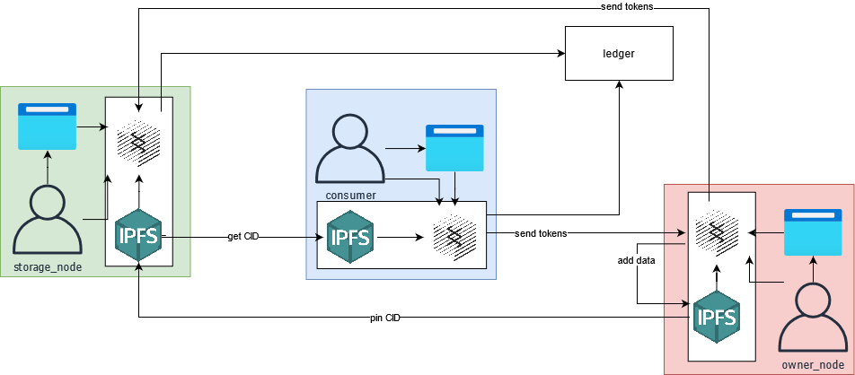
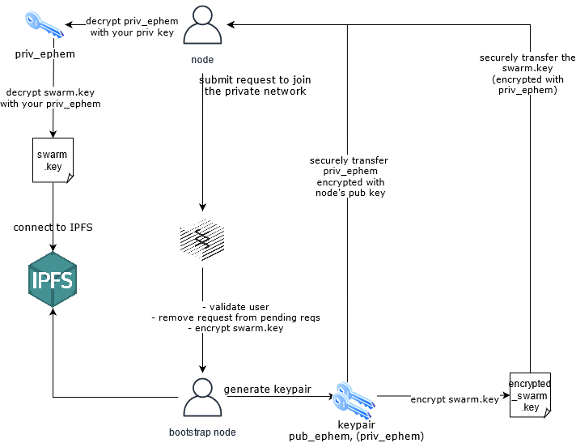
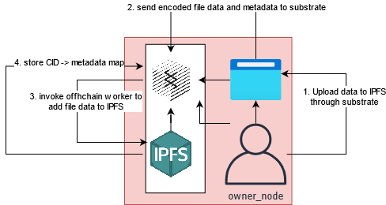
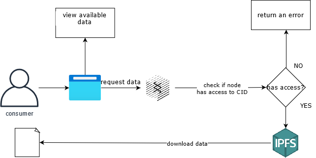
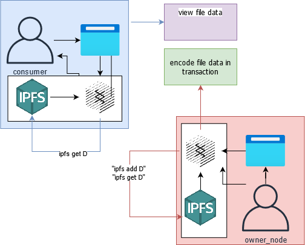

# W3F Grant Proposal

* **Project Name:** Decentralized Pinning Service
* **Team Name:** Driemworks
* **Payment Address:** 0x6ec0D6c005797a561f6F3b46Ca4Cf43df3bF7888 (DAI)

## Project Overview :page_facing_up:

### Overview

Mercury is a fully decentralized data management solution adding additional functionality and structure to a private IPFS network through Substrate. Our initial use case is a fully decentralized pinning service. Current solutions for decentralized storage are either lacking in security and privacy or rely on some centralized service to account for it. To illustrate this point, consider how IPFS makes your data available to any peer, the usage of a pinning service (such as Piñata) necessitates centralization, since the ipfs cluster in use is behind a centralized API and paywall, or how Textile de-decentralizes Filecoin. A fully decentralized approach provides individuals a platform without the risks associated with centralized APIs and also the opportunity to profit from their passive storage. In addition to the benefits of decentralization, the modularity and upgradeability provided with substrate would allow us to easily account for API changes or library upgrades. We propose a *decentralized pinning service*, facilitating an ecosystem that:

* incentivizes and rewards nodes to provide off-chain storage
* provides on-chain governance and moderation
* more control over your data and the ability to store and share private data

 There are various immediate real world benefits. IPFS provides a more resilient and efficient way to access data. There is no third party that acts as platform owner, maintainer, or administrator, and so the platform itself doesn't act as a revenue generating source. Transparent governance and moderation is also achievable with this approach. Users benefeit from a means of passive income by providing storage, and content creators benefit from a higher degree of freedom, means of support and funding, and also a more robust/public accountability and traceability.

### Project Details
The goal of this project is to provide a fully decentralized way for users to store and interact with their own and other's data. We aim to solve the following problems:

1) **Security and Privacy**: When data is hosted in a decentralized network it's available to any node in the network. There are no permissions and no easy way to securely store data.
2) **Availability and Replication**: Availbility of any CID in the network is not guaranteed. Current solutions for this issue rely on centralization to some extent.

We accomplish this by building a permissioned, indexable layer on top of a private IPFS network by expanding on [previous work](https://github.com/rs-ipfs/substrate) which laid the foundation for IPFS integration with substrate and the runtime module which will be our initial focus. Using this as the base, we build a trustless way for new nodes to join the network, provide a way for content owners to control access to their content and then elaborate on our solution to incentivize nodes to provide storage by pinning data. Finally, we will clearly define governance in the context of decentralized storage, why it's needed, and how we will approach it. 

A simple use case would look like this. In the diagram below, I have included a "ledger" box to indicate that each node type will make both read and write operations to the ledger. In this schema, a node [adds data](#adding-data) to the private IPFS network along with publishing the file data and some condition to access the file, for now let's say some amount of a token. A `storage node` provides their storage rates to the network. An owner can [request storage](#providing-storage) from the storage node, which if accepted, means the storage node agrees to pin the file. The `consumer` node can then purchase access rights to the content from the owner and retrieve it from the storage provider.

##### The Private Network
We ensure that membership of the IPFS network is synchronized with the blockchain by defining a static set of nodes and encoding them in the genesis block.
To join the network, a node invokes some extrinsic that initiates the process to receive the swarm key and join the network. The process is broken down as:

1) A node initiates a request and it is added to a queue
2) a bootstrap node encrypts its `swarm.key` with a newly created ephemeral public/private keypair and sends the file to the new node. Call this m0.
3) Construct a message containing the private key associated with the public used to decrypt m0 and encrypt that message using the new node's public key. Call this m1.
4) The new node decrypts all messages to recover the swarm key
   1) decrypt m1 with the new node's private key to get the privephem
   2) decrypt m0, the encrypted swarm.key, with privephem.
   3) connect to the private cluster by injecting swarm.key into ipfs.

##### Adding Data

To add data to the network, a node provides an encoded file data (as a byte array) along with the file name, file extension, file size and description. We encode this along with the account id, current timestamp, and CID (associated with the data) to build a full record of content in the network. We can expand on this to let the owner specify conditions for nodes to be able to access the content, such as the transfer of some amount of tokens (more on this [here](#accessing-and-retrieving-data)). 

**Future Development:** We can incorporate validations prior to adding the data to the private IPFS network in order to verify the content is not illicit/illegal, not a virus, etc. with an OCW, but for now we will perform no validations.

##### Accessing and Retrieving Data
Nodes can reference the blockchain to see what data is available in IPFS along with who has the file pinned and who is online. With this the node can see which data is currently available. 

We add a validation before we call IPFS to check if the origin (calling node) is authorized to access the data. If authorized, the call to retrieve it from IPFS proceeds, otherwise an error will occur.

##### Providing Storage 
Nodes are able to pin any content that is available in the network without the requirement that another node offers them payment through the process outlined below:

A node that acts as a storage provider will broadcast their current requested storage rates (in tokens/gb/second) along with their total available storage. 

A problem with a decentralized system is availability. Adding a file to the network allows nodes to access it but this doesn't guarantee that the file is actually available (due to the nature of IPFS). To track availability of some CID `C`, we track nodes that are both: 
1) nodes who have pinned `C`
2) nodes who are online

We will refer to this group of nodes as the **storage provider pool for C**, or poolC for short.

Owner nodes then will send a `request` to a candidate storage node, specifying a desired rate R tokens/gb/sec, reference to the object (tx hash of tx containing the file metadata from earlier), reward distribution epoch blocks (the number of blocks that the node must hold the file for to get a reward).

This can probably lead to some interesting economic analyses? For example, if you agree to some really high rate and have some long term storage and then the price of the token (in relation to fiat) increases, then you will end up paying a large sum of money for storage. Contrary to this, if a node agrees to some low long term rate and the price drops, they may not profit much. 

##### Governance
A problem inherent to decentralization is abuse of the privacy and security offered by the technology. For example, if the platform is used to host illegal content, or mislabeled content, or malicious content, then we need to be able to anticipate, identify, and purge this content and associated nodes from the network. We need multiple levels of authority to be involved here. Some things that we want to keep in mind:
- we cannot rely on community-driven moderation only
- will have a set of "supreme nodes" that are responsible for taking action against flagged content or nodes. 

#### What it is not
* Data stored is immutable but not indefinitely *persistent*. Data is still subject to the limitations outlined here: **https://docs.ipfs.io/concepts/persistence/**.

### Ecosystem Fit

Help us locate your project in the Polkadot/Substrate/Kusama landscape and what problems it tries to solve by answering each of these questions:

* Where and how does your project fit into the ecosystem?
  * This project greatly expands on off-chain storage solutions for blockchains.
* Who is your target audience (parachain/dapp/wallet/UI developers, designers, your own user base, some dapp's userbase, yourself)?
  * 1) Developers
    * App developers can benefit from decentralized storage for many reason already mentioned earlier. DApp developers specifically can benefit being able to apply rules on top of raw storage.
  * 2) My own user base
    * a) content creators: Content creators receive support directly from consumers. They do not need to relinquish their data to a third party to do so.
    * b) storage providers: Storage providers can profit from their passive storage.
    * c) content consumers: Consumers will not have to alter their behavior in terms of the way they access content, though interaction could change in the future.
* What need(s) does your project meet?
  * The project expands on current off-chain storage capabilities with IPFS. It will enable incentive for nodes to provide storage and pin data, as well as provide low-cost ways for consumers to support creators and for creators to sell content and affordably host it.
  * Fair and transparent governance will do away with the obfuscatory and totalitarian moderation done on today's centralized platforms.
* Are there any other projects similar to yours in the Substrate / Polkadot / Kusama ecosystem?
  * If so, how is your project different?
    * Yes: We build on: https://github.com/rs-ipfs/substrate
  * If not, are there similar projects in related ecosystems?
    * Yes:
      * Pinning services (like Piñata)
        * pinning services are not fully decentralized
      * Filecoin
        * filecoin doesn't benefit from usage of substrate
      * Textile
        * textile is not fully decentralized

## Team :busts_in_silhouette:

### Team members

* Name of team leader
  * Tony Riemer 
* Names of team members
  * TBD

### Contact

* **Contact Name:** Tony Riemer
* **Contact Email:** tonyrriemer@gmail.com
* **Website:**

### Legal Structure

* **Registered Address:**
  * N/A
* **Registered Legal Entity:**
  * N/A

### Team's experience

Tony Riemer has over 5 years of experience as a professional full-stack engineer.

### Team Code Repos

* https://github.com/<your_organisation>
* https://github.com/<your_organisation>/<project_1> <-- MY SUBSTRATE FORK
* https://github.com/<your_organisation>/<project_2> <-- THE REACT UI

Please also provide the GitHub accounts of all team members. If they contain no activity, references to projects hosted elsewhere or live are also fine.

* https://github.com/driemworks

### Team LinkedIn Profiles (if available)

https://www.linkedin.com/in/tony-riemer/

## Development Status :open_book:

If you've already started implementing your project or it is part of a larger repository, please provide a link and a description of the code here. In any case, please provide some documentation on the research and other work you have conducted before applying. This could be:

* links to improvement proposals or [RFPs](https://github.com/w3f/Grants-Program/tree/master/rfp-proposal) (requests for proposal),
* academic publications relevant to the problem,
* links to your research diary, blog posts, articles, forum discussions or open GitHub issues,
* references to conversations you might have had related to this project with anyone from the Web3 Foundation,
* previous interface iterations, such as mock-ups and wireframes.

## Development Roadmap :nut_and_bolt:

### Overview

* **Total Estimated Duration:** 3.5 months
* **Full-Time Equivalent (FTE):**  1 FTE
* **Total Costs:** $10,000 USD

I have designed each milestone to provide a functioning product at the end of each one.
Initially, we will leverage substrate to create an "indexable" private ipfs network. 

### Milestone 1 — Implement Substrate Modules
Milestone 1 Goal:
  The outcome of the first milestone is to create an permissioned, indexable private ipfs network. That is, an IPFS network where we can search for files in a similar way as a standard file stystem, apply permissions, etc. We do this by creating a private IPFS network with a finite number of nodes and encode this membership within the genesis block. Then we encode file metadata within the blockchain for each piece of data added to IPFS by a node.  We will build a decentralized blog user interface that lets users search, view, upload and download data. 

* **Estimated duration:** 4 Weeks
* **FTE:**  1
* **Costs:** 4000 DAI

| Number | Deliverable | Specification |
| -----: | ----------- | ------------- |
| 0a. | License | Since this is based on a fork of substrate, it will use all of the same licenses as substrate. |
| 0b. | Documentation | We will provide both **inline documentation** of the code and a basic **tutorial** that explains how a user can (for example) spin up one of our Substrate nodes and send test transactions, which will show how the new functionality works. |
| 0c. | Testing Guide | Core functions will be fully covered by unit tests to ensure functionality and robustness. In the guide, we will describe how to run these tests. |
| 0d. | Docker | We will provide a Dockerfile(s) that can be used to test all the functionality delivered with this milestone. |
| 0e. | Article | We will begin keeping a development blog detailing progress, discoveries, and more.
| 1. | Private IPFS setup | Create the private ipfs network and define bootstrap nodes, encode the bootstrap nodes in the geneseis block. |
| 2. | Substrate module: IPFS Module | Using [rs-ipfs/substrate](https://github.com/rs-ipfs/substrate) as the basis for our runtime module, we will build additional functionality to encode the file metadata within the blockchain. |
| 3. | Build App | Build the main application that bundles IPFS and substrate |
| 4. | User Interface | We will build a minimal user interface to allow users to interact with their nodes. This will be done with react and polkadot.js. This initial phase will be mostly setup. We will provide a **view** for users to view file metadata, to **add** data to their ipfs node, to **view** their cached data , and to **retrieve** files based on the file metadata available. |

### Milestone 2 — Additional features
Milestone 2 Goal: 
  The second milestone delivers a mechanism to enable the pinning service. Here we:
  - build the tools needed to let new nodes join the private IPFS network.
  - 

* **Estimated Duration:** 4 weeks 
* **FTE:**  1
* **Costs:** 3000 DAI

| Number | Deliverable | Specification |
| -----: | ----------- | ------------- |
| 0a. | License | Apache 2.0 / GPLv3 / MIT / Unlicense |
| 0b. | Documentation | We will provide both **inline documentation** of the code and a basic **tutorial** that explains how a user can (for example) spin up one of our Substrate nodes and send test transactions, which will show how the new functionality works. |
| 0c. | Testing Guide | Core functions will be fully covered by unit tests to ensure functionality and robustness. In the guide, we will describe how to run these tests. |
| 0d. | Docker | We will provide a Dockerfile(s) that can be used to test all the functionality delivered with this milestone. |
| 0e. | Article | |
| 1.  | | | 
| 2. | | |

### Milestone 3 — Additional features

* **Estimated Duration:** 4 weeks 
* **FTE:**  1
* **Costs:** 3000 DAI

| Number | Deliverable | Specification |
| -----: | ----------- | ------------- |
| 0a. | License | Apache 2.0 / GPLv3 / MIT / Unlicense |
| 0b. | Documentation | We will provide both **inline documentation** of the code and a basic **tutorial** that explains how a user can (for example) spin up one of our Substrate nodes and send test transactions, which will show how the new functionality works. |
| 0c. | Testing Guide | Core functions will be fully covered by unit tests to ensure functionality and robustness. In the guide, we will describe how to run these tests. |
| 0d. | Docker | We will provide a Dockerfile(s) that can be used to test all the functionality delivered with this milestone. |
| 0e. | Article | |
| 1.  | Offchain worker: sending data offchain |   | 
| 2. | Substrate Module: IPFS Module | |

## Future Plans

* Short term
  * build a webpage to advertise the existense of the project, direct them to documentation, web3, etc.

* Long term:
  * Further abstract storage from the user by allowing a node to pay a fee to use another node's IPFS node. 
    * This node only need to run a substrate node
    * Could be ideal for mobile devices, light clients, etc.

## Additional Information :heavy_plus_sign:

**How did you hear about the Grants Program?** Web3 Foundation Website
* Work you have already done.
  * Please refer to the github links above for the organization.

